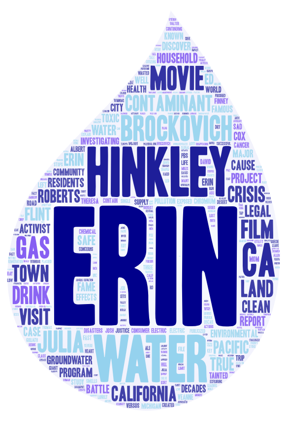
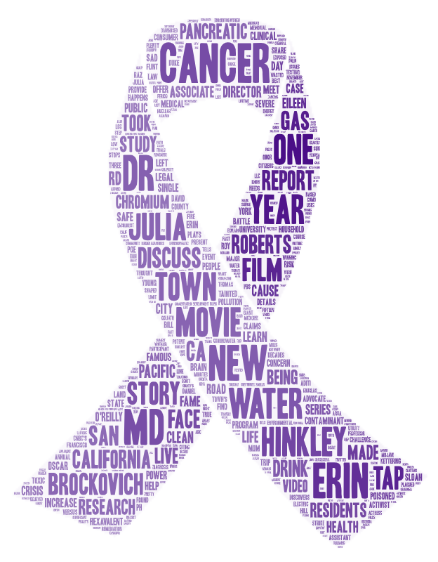
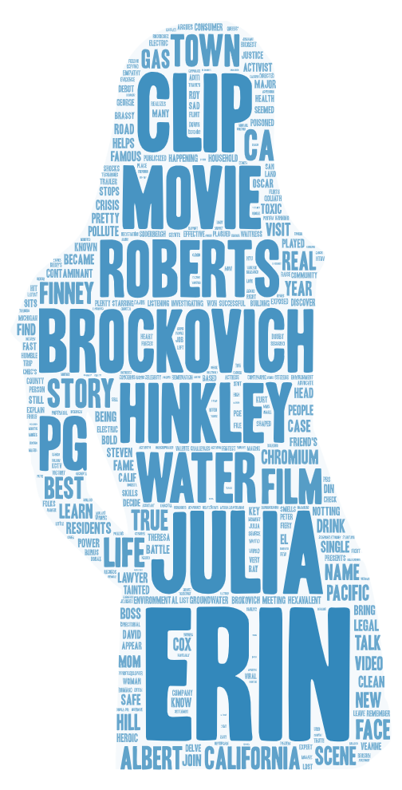

# **GEOG 458: Lab 2- Web data collection and visualization**

## **Context**

For context, the small town of Hinkley, California had its groundwater contaminated by Pacific Gas & Electric Co. from 1952 to 1966. This groundwater contamination had lasting impacts on the residents in the area. One of the most significant impacts was that many of the residents developed cancer.

## **Topic and search parameters**

For this lab, I chose my topic to be the **geographic** and **environmental** phenomenon surrounding **Hinkley, California**. 

The three search parameters I used on YouTube include:

1. "Hinkley California water contamination"

2. "Hinkley California cancer"

3. "Hinkley California erin brockovich"

I chose these search parameters to make comparisons to see if keeping the location the same, and changing the end topic words would yield different results. I also thought that keeping the location constant, but changing the end topic words would provide more insight into different dimensions of this topic. 

For instance, the first search parameter addresses the geographic and environmental dimensions of this topic.

Additionally, the second search parameter addresses the geographic and environmental public health dimension of this topic.

Lastly, the third search parameter addresses the geographic and enviromental activist dimension of this topic.

## **Word Clouds**

### *Word Cloud 1*

> Word Cloud 1 can be accessed [here](https://github.com/KatelynSaechao/GEOG458_Lab2/blob/a45f587aa573c0141963ca57364150ff397f27d2/img/wordcloud-1.png)

### *Word Cloud 2*

> Word Cloud 2 can be accessed [here](https://github.com/KatelynSaechao/GEOG458_Lab2/blob/a45f587aa573c0141963ca57364150ff397f27d2/img/wordcloud-2.png)

### *Word Cloud 3*

> Word Cloud 3 can be accessed [here](https://github.com/KatelynSaechao/GEOG458_Lab2/blob/a45f587aa573c0141963ca57364150ff397f27d2/img/wordcloud-3.png)

### *Similarities*

One similarity for all of the word clouds is that the name "Erin Brockovich" is one of the biggest words. Another similarity is that "Movie" is also a very prevalent word for all word clouds. Moreover, "Water" appears frequently across all word clouds.

### *Differences*

One difference is that the first word cloud seems to talk more about "Contaminants",  and "Water", which relates directly to the environment. Another difference is that the second word cloud talks the most about "Cancer", which relates to environmental public health. To add further, the third word cloud talks the most about the Erin Brockovich movie as demonstrated by the words "Clip", "Movie", and "Julia Roberts". 

### *Patterns Observed*

I think that the similarities that I observed were because the **movie**, titled **"Erin Brockovich"** brought a lot of attention to the **water** contamination problem in Hinkley, California. It makes sense that Erin Brockovich appeared in all word clouds because she was vital in identifying the connection between the groundwater contamination and rates of cancer in Hinkley, California.

## **Future Research**

If I were to do this research again, I would conduct it differently. To improve my research, I think that I would use boolean operators to exclude the mention of the words "Movie" and "Film". This is because many of the words in the word cloud seem to come from videos about the movie, rather than the actual real life story of Hinkley, California. I would also try to reference and collect data from other social media website to see if the same search parameters yield similar results, regardless of the platform that the information comes from.

## **Difference in Expectations and Things that Stand Out**

I expected the words  in all word clouds to be more directly related to the environment, but it seems like only word cloud and search result 1 aligns the most with the environment.

One thing that stood out to me was that the second word cloud included words in Spanish. The second word cloud was the only one that included words in Spanish.

## **Links**

### *Word Cloud Links*

* [Word Cloud 1](https://github.com/KatelynSaechao/GEOG458_Lab2/blob/a45f587aa573c0141963ca57364150ff397f27d2/img/wordcloud-1.png)

* [Word Cloud 2](https://github.com/KatelynSaechao/GEOG458_Lab2/blob/a45f587aa573c0141963ca57364150ff397f27d2/img/wordcloud-2.png)

* [Word Cloud 3](https://github.com/KatelynSaechao/GEOG458_Lab2/blob/a45f587aa573c0141963ca57364150ff397f27d2/img/wordcloud-3.png)

### *Search Result Spreadsheet Links*

* [Search Result 1](https://github.com/KatelynSaechao/GEOG458_Lab2/blob/a45f587aa573c0141963ca57364150ff397f27d2/assets/search-result-1.csv)

* [Search Result 2](https://github.com/KatelynSaechao/GEOG458_Lab2/blob/a45f587aa573c0141963ca57364150ff397f27d2/assets/search-result-2.csv)

* [Search Result 3](https://github.com/KatelynSaechao/GEOG458_Lab2/blob/a45f587aa573c0141963ca57364150ff397f27d2/assets/search-result-3.csv)
